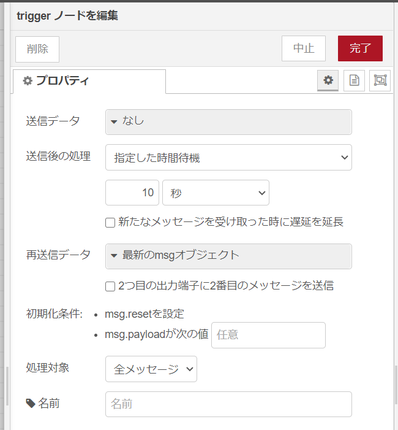

# node-red-contrib-switchbot-meter

[SwitchBot Meter](https://www.switchbot.jp/product-page/switchbot-thermometer-hygrometer-the-meter) から読み取るための Node-RED の node を追加します。  
SwitchBot Meter は、以下のセンサーを搭載した Bluetooth LE デバイスです。

- 湿度と温度

## Dependencies

- [Node.js](https://nodejs.org/en/) 10 +
- [node-switchbot](https://github.com/futomi/node-switchbot)
- [@abandonware/noble](https://github.com/abandonware/noble)

## 事前のインストール

bluetooth 関係のライブラリを先に入れておきます。Ubuntu/Debian/Raspbian ならいけるとおもう。

```sh
sudo apt-get install bluetooth bluez libbluetooth-dev libudev-dev
```

他の OS は[@abandonware/noble](https://github.com/abandonware/noble)を参考に入れれば動くかも知れません。（未テスト）

## Install

Node-RED のユーザーディレクトリに移動してインストールします。  
先に事前のインストールをしていないと依存パッケージのビルド時に失敗します。

```sh
cd ~/.node-red
npm i @kzfk52/node-red-contrib-switchbot-meter
```

## Usage

設定パラメータとして、Bluetooth の MAC アドレスを指定します。  
スマホアプリでデバイス MAC アドレスを調べて下さい。

1. 歯車アイコン「設定」
2. 設定ウインドウ右上「・・・」
3. 本体情報の「BLE MAC」

---

注意：約 2 秒ごとに広告パケットが飛んできますので、後段にトリガーファンクションを接続して、データピックアップをしてください。  


---

## output msg format

出力される`msg`は次のような`msg`オブジェクトです。

```json
{
  "meter": {
    "macaddress": "xx:xx:xx:xx:xx:xx",
    "rssi": -50,
    "temperature": 27.6,
    "temperature_f": 81.6,
    "humidity": 53,
    "battery": 100
  }
}
```

## Node-RED Flow サンプル

[examples](examples/)ディレクトリに、データ取得して 120 秒ごとに、Debug ノードにデータを送信するフローを置いています。  
Meter ノード の MacAddr をセットすると試すことが出来ます。

## 参考

- [node-switchbot](https://www.npmjs.com/package/node-switchbot)
- [sensorTag](https://github.com/node-red/node-red-nodes/tree/master/hardware/sensorTag)
- [Node-RED のノードを作り、Node-RED Library に登録する](https://ambidata.io/blog/2016/09/22/node-red/)

---

## License

This software is released under the MIT License, see LICENSE
