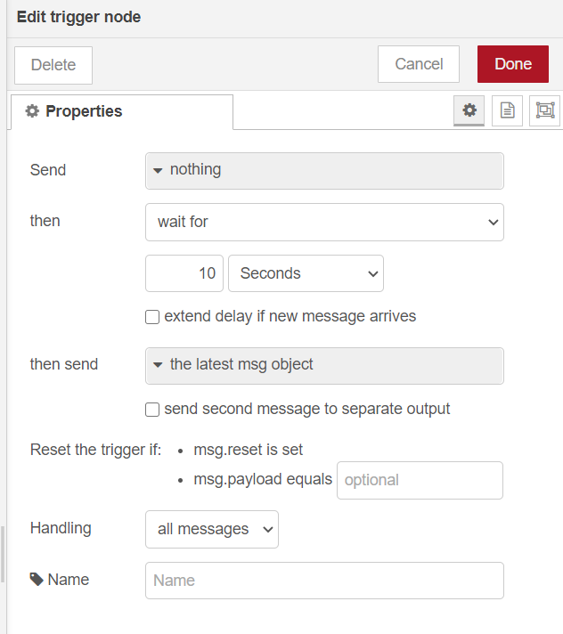

# node-red-contrib-switchbot-meter

This node adds support to Node-RED to read from the Wonderlabs [SwitchBot Meter](https://www.switch-bot.com/meter).

The SwitchBot Meter is a Bluetooth LE device hosting the following sensors:

- Humidity and Temperature

## Dependencies

- [Node.js](https://nodejs.org/en/) 10 +
- [node-switchbot](https://github.com/futomi/node-switchbot)
- [@abandonware/noble](https://github.com/abandonware/noble)

## Pre Install

Dependency library the [@abandonware/noble](https://github.com/abandonware/noble), some linux libraries related Bluetooth as follows if the OS is Ubuntu/Debian/Raspbian.

```sh
sudo apt-get install bluetooth bluez libbluetooth-dev libudev-dev
```

Note: Other operating systems may work if you put in [@abandonware/noble](https://github.com/abandonware/noble) for reference. (untested)

## Install

Run the following command in your Node-RED user directory

```sh
cd ~/.node-red
npm i @kzfk52/node-red-contrib-switchbot-meter
```

## Usage

The MAC address of Bluetooth is specified as a configuration parameter.  
Look up the device MAC address in the smartphone app.

1. gear icon to "Setting"
2. the "..." in the upper right corner of the setting window
3. the "BLE MAC" of Info

---

Note: An ad packet will be sent out about every 2 seconds, so connect the trigger function to the later stage for data pickup.  


---

## output msg format

The output `msg` is the following `msg` object.

```json
{
  "meter": {
    "macaddress": "xx:xx:xx:xx:xx:xx",
    "rssi": -50,
    "temperature": 27.6,
    "temperature_f": 81.6,
    "humidity": 53,
    "battery": 100
  }
}
```

## Node-RED Flow Sample

In the [examples](examples/) directory, It puts a flow that fetches data and sends it to the Debug node every 120 seconds.  
You can try it out by setting up a MacAddr in Meter node.

## References

- [node-switchbot](https://www.npmjs.com/package/node-switchbot)
- [sensorTag](https://github.com/node-red/node-red-nodes/tree/master/hardware/sensorTag)
- [Node-RED のノードを作り、Node-RED Library に登録する](https://ambidata.io/blog/2016/09/22/node-red/)

---

## License

This software is released under the MIT License, see LICENSE
